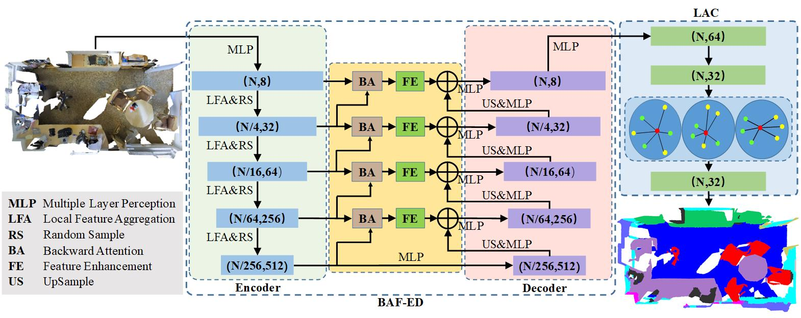

# Backward Attentive Fusing Network with Local Aggregation Classifier for 3D Point Cloud Semantic Segmentation

This is the official implementation of **BAF-LAC** (TIP 2021), a novel point cloud semantic segmentation paradigm that introduces more context information. For technical details, please refer to:

**Backward Attentive Fusing Network with Local Aggregation Classifier for 3D Point Cloud Semantic Segmentation**<br />
Hui Shuai*, Xiang Xu*, Qingshan Liu. <br />
**[[paper](https://ieeexplore.ieee.org/abstract/document/9410334)]** <br />



### (1) Setup
This code has been tested with Python 3.6, Tensorflow 1.13.1, CUDA 10.0 on Ubuntu 16.04.

- Clone the repository
```
git clone https://github.com/Xiangxu-0103/BAF-LAC.git && cd BAF-LAC
```
- Setup python environment
```
conda create -n baflac python=3.6.8
conda activate baflac
pip install tensorflow-gpu==1.13.1
pip install -r helper_requirements.txt
sh compile_op.sh
```

### (2) S3DIS
S3DIS dataset can be found
<a href="https://docs.google.com/forms/d/e/1FAIpQLScDimvNMCGhy_rmBA2gHfDu3naktRm6A8BPwAWWDv-Uhm6Shw/viewform?c=0&w=1">here</a>. 
Download the files named "Stanford3dDataset_v1.2_Aligned_Version.zip". Uncompress the folder and move it to
`/home/data/S3DIS`.

- Preparing the dataset:
```
python utils/data_prepare_s3dis.py
```
- Start 6-fold cross validation:
```
sh jobs_6_fold_cv_s3dis.sh
```
- Move all the generated results (*.ply) in `/test` folder to `/home/data/S3DIS/results`, calculate the final mean IoU results:
```
python utils/6_fold_cv.py
```

### (3) Semantic3D
7zip is required to uncompress the raw data in this dataset, to install p7zip:
```
sudo apt-get install p7zip-full
```
- Download and extract the dataset. First, please specify the path of the dataset by changing the `BASE_DIR` in "download_semantic3d.sh"
```
sh utils/download_semantic3d.sh
```
- Preparing the dataset:
```
python utils/data_prepare_semantic3d.py
```
- Start training:
```
python main_Semantic3D.py --mode train --gpu 0
```
- Evaluation:
```
python main_Semantic3D.py --mode test --gpu 0
```

**Note:**
- Preferably with more than 64G RAM to process this dataset due to the large volume of point cloud

### (4) SemanticKITTI

SemanticKITTI dataset can be found <a href="http://semantic-kitti.org/dataset.html#download">here</a>. Download the files
related to semantic segmentation and extract everything into the same folder. Uncompress the folder and move it to
`/home/data/semantic_kitti/dataset`.

- Preparing the dataset
```
python utils/data_prepare_semantickitti.py
```

- Start training:
```
python main_SemanticKITTI.py --mode train --gpu 0
```

- Evaluation:
```
sh jobs_test_semantickitti.sh
```

### Citation
If you find our work useful in your research, please consider citing:

    @article{shuai2021backward,
      title={Backward Attentive Fusing Network with Local Aggregation Classifier for 3D Point Cloud Semantic Segmentation},
      author={Shuai, Hui and Xu, Xiang and Liu, Qingshan},
      journal={IEEE Transactions on Image Processing},
      year={2021},
      publisher={IEEE}
    }

### Acknowledge
- Our code refers to <a href="https://github.com/QingyongHu/RandLA-Net">RandLA-Net</a>.
